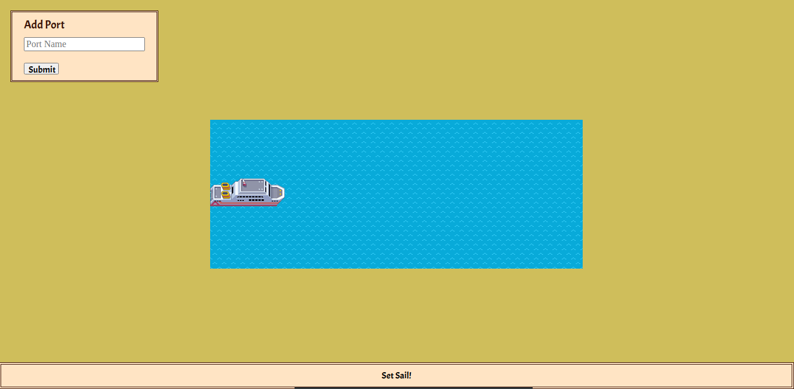
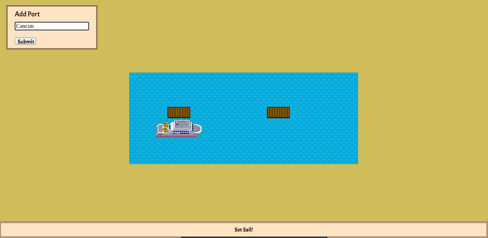
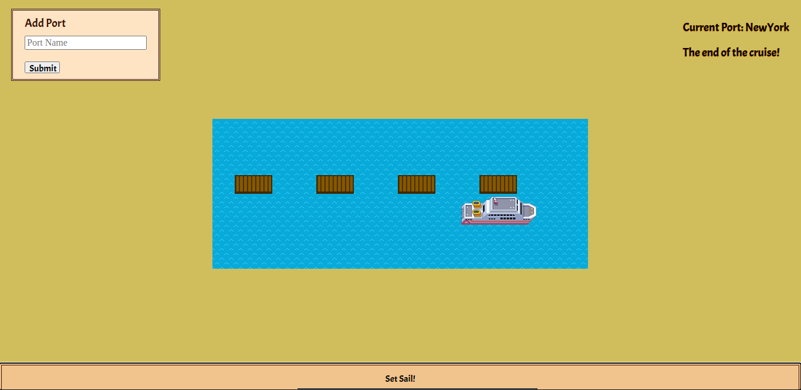

# Cruise-ships

## About

If, just like me, you've always dreamed of going for a cruise but haven't had an opportunity yet - not to worry! You can have your cruise right here, right now! Moreover you can pick your own destinations, isn't it GREAT!

## Setup

Clone my repo and open index.html. It will open a tab in your browser.

# Description

## Let's begin

To begin with you have to plan your itinerary. In the 'Add port' form type your desired ports to visit.

## Enjoy the cruise

And now you can enjoy the cruise! Just press the 'Set sail!' button til you reach your final port.

## The end of the cruise!

I hope you have enjoyed the trip! Bon voyage with your further journeys!

## Contributing

Pull requests are welcome. For major changes, please open an issue first to discuss what you would like to change.

## Author

Created by Viktoriia Petrova as part of <a href="https://www.manchestercodes.com" target="_blank">Manchester Codes</a> learning process..
